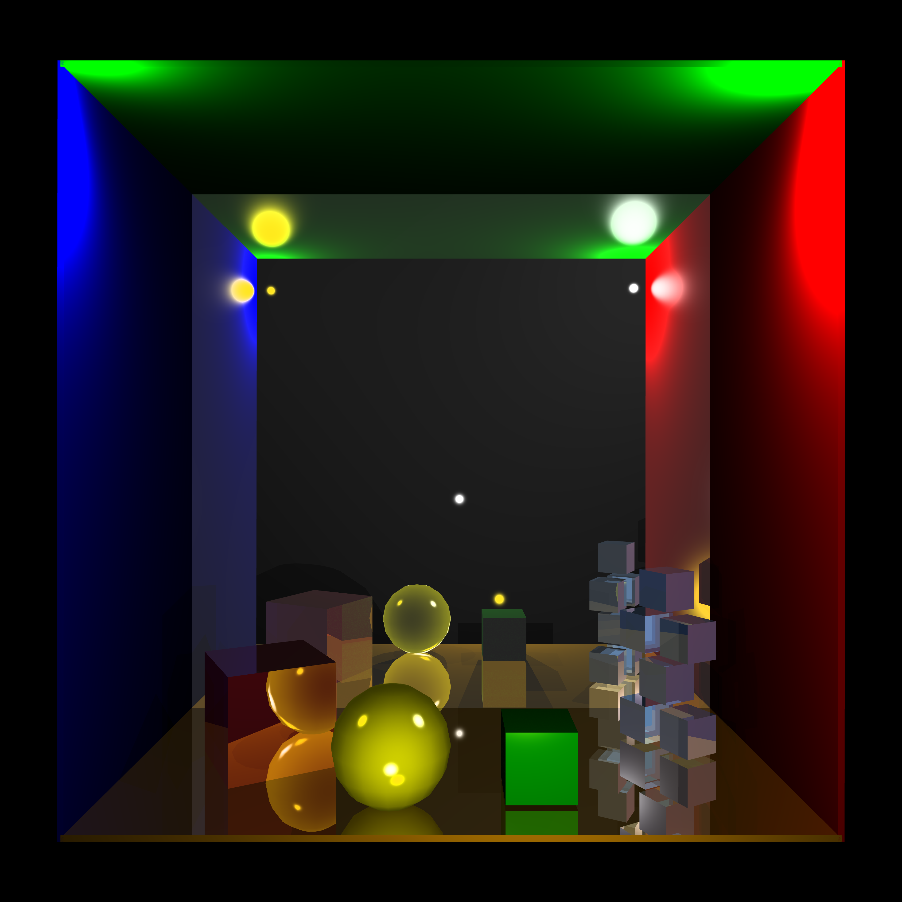

A simple ray-tracer written in Javascript + THREE.JS. Once loaded into a browser, it will display options to increase resolution or thread count,
as well as bounce count and subpixel sampling. When started it renders a pre-defined Cornell Box:

## Example output

